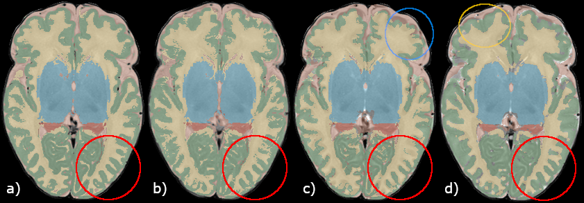

# BIMP_SegmentationInterpolation

This repository is intended as supplental data for the manuscript "Improved neonatal brain MRI segmentation by interpolation of motion corrupted slices"

# Part 1 - alternative segmentation techniques

# Part 2 - alternative interpolation techniques
Instead of interpolating T2-weighted images, followed by segmentation, it may be more appropriate to directly interpolate the segmentation images. In this supplemental data we show a preliminary visual assessment of two segmentation-interpolation methods, compared to the original segmentation and results from the proposed method in this paper. 

For this assessment, a scan without motion artifacts was used to visually evaluate segmentation results of different techniques, which were:
- original segmentation,
- interpolation of the T2-weighted scan, followed by segmentation,
- morphological contour interpolation from ITK using 3D slicer,
- _ImageShapeBasedInterpolation_ from MevisLab.

Morphological contour interpolation works properly in structures with a more flattened surface (e.g. cerebellum, brainstem and deep gray matter), but in structures with more protrusion/depression, e.g. cortical gray matter and white matter, interpolation results in wrong estimations. In Figure 2c, we can see that interpolation leads to over segmentation of white matter, compared to the original segmentation (Figure 2a) and the proposed method (Figure 2b).
  Shape-based interpolation seems more accurate than contour interpolation, but details at the cortical gray matter and white matter interface are lost (Figure 2d).
  

Figure 2: 

