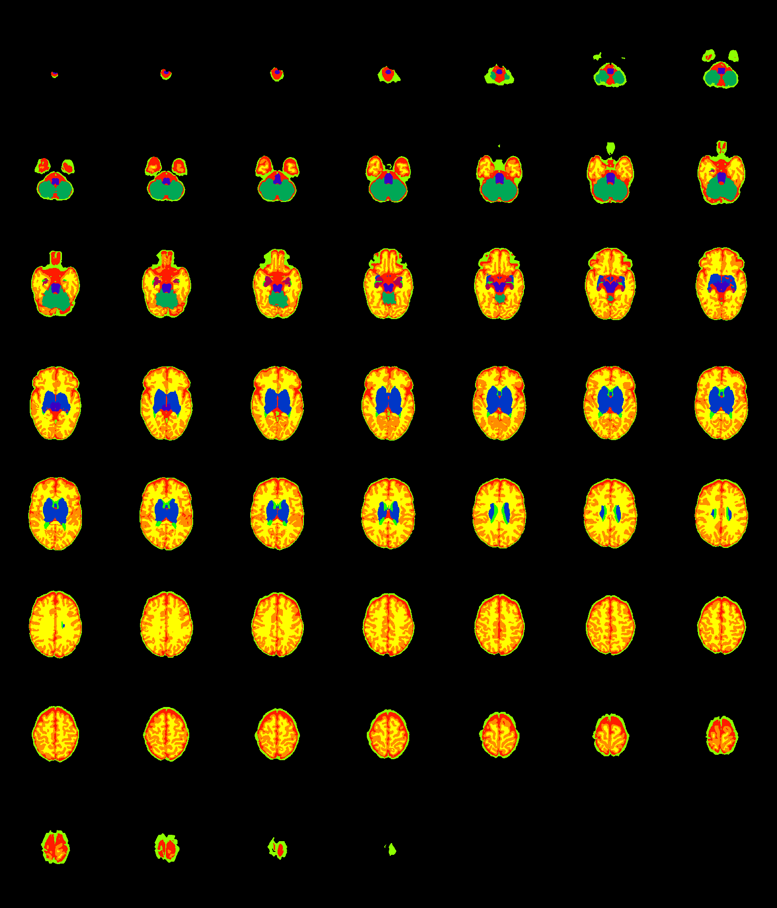
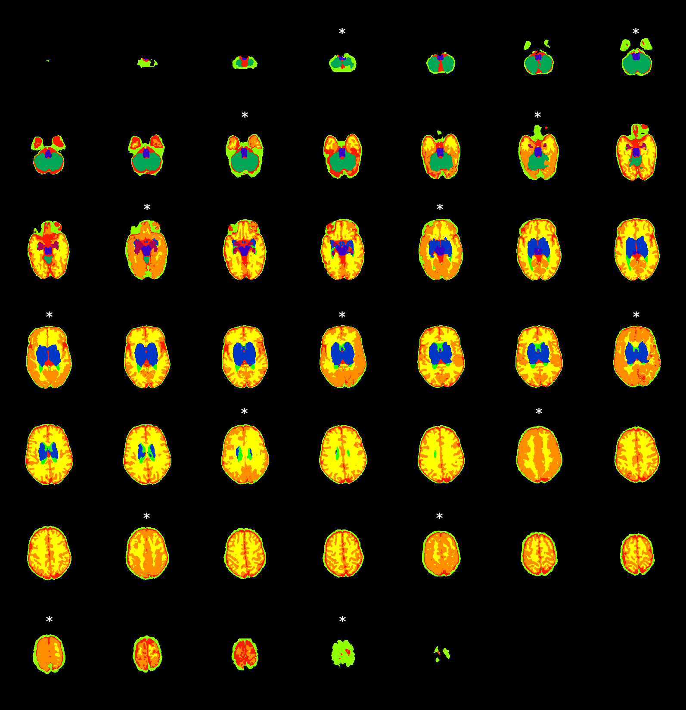

# BIMP supplemental data

This repository is intended as supplemental data for "Improved neonatal brain MRI segmentation by interpolation of motion corrupted slices"

# Part 1 - alternative interpolation techniques
Instead of interpolating T2-weighted images, followed by segmentation (as proposed in the paper), it may be more appropriate to directly interpolate the segmentation images. In this supplemental data we show a preliminary visual assessment of two segmentation-interpolation methods, compared to the original segmentation and results from the proposed method in this paper. 

For this assessment, a scan without motion artifacts was used to visually evaluate segmentation results of different techniques, which were:
- original segmentation,
- interpolation of the T2-weighted scan, followed by segmentation (proposed method),
- morphological contour interpolation from ITK using 3D slicer,
- _ImageShapeBasedInterpolation_ from MevisLab.

Morphological contour interpolation works properly in structures with a more flattened surface (e.g. cerebellum, brain stem and deep gray matter), but in structures with more protrusion/depression, e.g. cortical gray matter and white matter, severe segmentation errors were seen. In Figure 1c, we can see that interpolation leads to over segmentation of white matter, compared to the original segmentation (Figure 1a) and the proposed method (Figure 1b). Shape-based interpolation seems more accurate than contour interpolation, but details at the cortical gray matter and white matter interface are lost (Figure 1d).
  

Figure 1: Visual assessment of segmentation results using different interpolation methods. The red circle indicates a representative area for comparison between a) original segmentation, b) proposed method, c) Morphological Contour Interpolation with 3Dslicer, and d) shape-based interpolation with MevisLab. Visually, the white matter area in c) is much larger, compared to the original segmentation in a); loss of cortical gray matter labels is highlighted with the blue ellipse. d) is more comparable to a) and b), but here,  loss of sulcation/gyration details is observed in the cortical gray matter and white matter, resulting in a larger gray matter volume (yellow ellipse).

In our opinion, it would be very interesting to further assess interpolation methods for segmentation images. This would require optimizing interpolation methods for accurate estimation of structures with a flattened surface, but also of structures with more protrusion/depression, such as cortical gray matter, white matter and cerebrospinal fluid.

# Part 2 - How automatic segmentation techniques deal with motion
The impact of motion on segmentation may differ amongst different neonatal brain segmentation techniques. In this supplemental data, segmentation results of a second neonatal brain segmentation pipeline are shown for comparison. The structural pipeline of the Developing Human Connectome Project (dHCP) was used to segment data without (Figure 2) and with (Figure 3) motion artifacts [1].

Figure 2: Segmentation of a scan without motion artifacts using dHCP structural pipeline. Please note that color coding is different from figures in the main document.

Figure 3: Segmentation of a scan with motion artifacts using dHCP structural pipeline. Slices with motion artifacts are marked with a white asterisk. Segmentation errors caused by motion appear similar in both techniques, but small differences can be observed (see Figure 4 of main document showing the same scan segmented using MANTiS). Please note that color coding is different from figures in the main document.

# References
[1] A. Makropoulos, E. C. Robinson et al. "The Developing Human Connectome Project: a Minimal Processing Pipeline for Neonatal Cortical Surface Reconstruction". Available at: https://github.com/BioMedIA/dhcp-structural-pipeline
